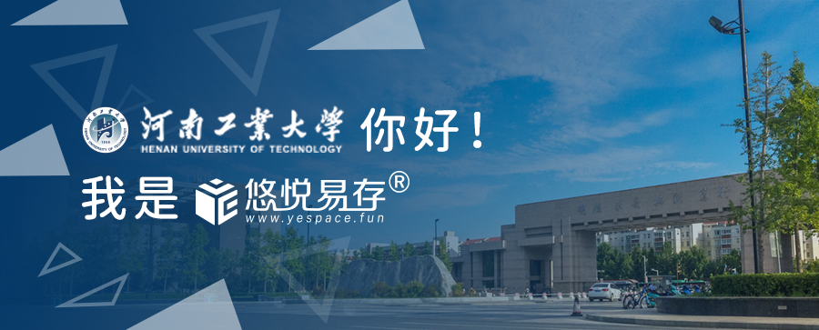

# 炎炎夏日，河南工业大学图书馆备考的同学们，发现多了..........

> 炎炎夏日，慵懒的蝉声聒噪了河工大的图书馆，巨大的喷泉洗刷了晴朗的天空，在这个普通的暑假，河南工业大学图书馆中的同学们将迎来全新的储物柜，该柜将由悠悦易存提供与维护，随着小悠一起了解一下吧！

<!--truncate-->

### 0. 河工大图书馆现状

七月，火热的季节。

河南工业大学的校园，安静而美丽。没有开学季的热闹和忙碌，只有树上的蝉鸣提示着这是一个炎热的暑假。

图书馆和往常一样，矗立在中原大地的蓝天下。门前的喷泉，在夏日里欢乐的变幻着水柱的节奏，映出一道彩虹。

在图书馆中，却是另一番景象，很多同学在馆中为了自己的目标不断努力，为了2022考研争分夺秒地复习，他们放弃了假期只为拥有更好的未来。

随着社会竞争的逐渐加剧，本科生考研的人数逐年上升，2021年预计将超过400万人，在大学图书馆中，有着得天独厚的学习条件与学习氛围，是“考研大军”的首选。

### 1. 一切为了学生，为了学生一切

河南工业大学图书馆是学校的文献信息资源中心，是为人才培养和科学研究服务的学术性机构，是学校信息化建设的重要组成部分，是校园文化和社会文化建设的重要基地。它担负着教育与信息服务的双重职能，也是全校师生开展学习和学术研究活动的重要场所。莲花街校区中心馆二至十层、地下一层，共有书库阅览室18个。全馆实行借阅一体的大流通管理模式，有阅览座位约5000个。

为开创图书馆管理、服务工作的新局面，秉承“读者第一，服务至上”的宗旨，悠悦易存®在图书馆领导的关心和支持下，于暑假期间在馆全面部署悠悦智能储物系统，以便为考研同学提供更好的服务。

项目一经公示便引来了小伙伴们的强烈围观：

如此接地气的图书馆，小悠真的是🍋了。

看到能给大家解决问题，小悠也是非常幸福的呢，回想小悠的大学也是一毕业啥都有了呢😂

第一批将在今天部署，共700余格，第二批我们也将尽量在一周之内部署完成，希望同学们耐心等待。

我们的寄存柜单格尺寸为40厘米(宽)×30厘米(高)×45厘米(深)，这可是专为同学们定制的哦，并且非常的美观，使用起来也十分方便。

第一期会部署在2，3，4层，后期具体部署的位置我们将在福利群中发布，寄存柜的详细位置可以通过公众号菜单栏的使用帮助中的空箱查询进行查看，或者通过公众号内回复"空箱"获取查看链接。

使用方式可以参考所部署区域的门型展架或者查看本期推送的第二篇文章哦~

**为了回馈同学们的热情，小悠将为上文中图中包含的同学们送上周卡一张，请上文图中包含的同学添加小悠的微信哦，小悠核实之后给您发放，再次感谢您的参与与支持！**

同学们的问题真的是太多了，小悠就不在这里一一回复了，有任何疑问都可以添加小悠的微信进行提问哦~

### 2.我们是谁

**悠悦易存®**的发起人是一群当年参加“考研”、“考公”的计算机专业的在校大学生。我们深感图书馆普通存包柜设计功能不足和“考试大军”需求冲突的痛苦。我们一方面从学生自己需求出发，另一方面寻求多家高校图书馆老师们的指导帮助，自己动手，请任课老师指导，从硬件、物联、软件方面研发出一整套高校图书馆存包解决方案。

**悠悦易存®**的宗旨是“大学生创业解决大学生身边事”，因此我们专注于高校，专注于高校图书馆存包服务。我们的运营模式也尽量贴合高校图书馆现有的管理模式。以最小的商业化行为，为图书馆备考的同学提供一点点便利，同时尽量减轻图书馆老师们和工作人员的日常繁琐的管理工作。2020年考研季，悠悦易存®累计部署**8,000+**存包箱格，服务**20,000+**应届考生，用户累计开箱数达**1,000,000+**。极大的减轻了图书馆老师和工作人员的负担，并受到广大同学的热烈欢迎。

### 3.写在最后

我们一直致力于解决高校学生的物品存放问题，希望我们的服务能够让您体会到前所未有的便利与愉悦，小悠将使用教程与使用过程中可能存在的问题都写在本条推送的第二篇文章里了，当然，如果私聊小悠小悠也会耐心为您解答的，真心祝同学们考研顺利，逢考必过！

