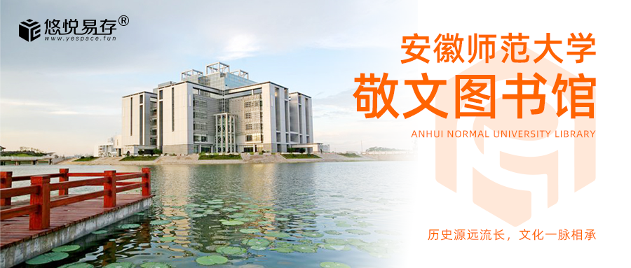
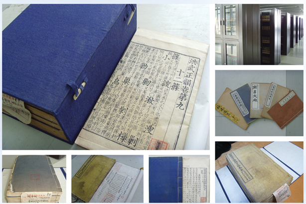

# 📢 历史源远流长，文化一脉相承，安徽师范大学图书馆，我们来了！

> 安徽师范大学敬文图书馆引入由悠悦易存提供的技术和产品支持的智能储物管理解决方案，由悠悦易存自主运营，馆方进行监督，确保同学们使用过程舒心，物品寄存安心，产品使用放心。

<!--truncate-->

安徽师范大学，位于安徽省芜湖市。是安徽省属重点大学，省部共建高校。学校前身是1928年创办的省立安徽大学，1946年更名为国立安徽大学，现安徽师范大学是1954年安徽大学师范学院独立建制的安徽师范学院，1972年升级为安徽师范大学，2005年芜湖师范专科学校并入。

刘文典、周建人、郁达夫、苏雪林、陈望道、朱湘、朱光潜、王星拱、杨亮功、程演生、陶因、张慰慈、丁绪贤、项南、许杰等一大批知名专家学者、社会贤达先后汇聚在菱湖之畔、镜湖之滨，著书立说，弘文励教。近百年的积淀使得安徽师范大学拥有强大的教学实力与先进的教学理念，学校拥有6个安徽省重点实验室，8门国家级精品课程，23个国家级一流本科专业建设点等若干资质，累计为国家培养全日制高等专门人才近30万名。

位于安徽师范大学中心的图书馆非常的有诗情画意，蔚蓝的天空、清澈的湖泊交相辉映，而处于他们之中极具设计感的敬文图书馆让人无比神往。馆藏古籍 20 余万册，位居安徽省高校之首，其中《洪武正韵》为国内唯一全本,元刻本《春秋胡氏传》、元刻明递修《通志》 、明嘉靖刻本《李太白全集》、《杜工部集》等均为海内外珍本。

图书馆始终坚持“以人为本，创新服务”的理念，为读者提供多元化服务：图书借阅与期刊阅览、信息咨询、查新查重、查收查引、文献传递、用户培训、学术与文化交流、学科导航、电子资源利用等基础服务。规范化和流畅化的自修管理一直是图书馆追求和提升的方向，旧系统不顺畅和不稳定的使用体验深深地困扰着馆方。**为了能够简化同学们的寄存需求，减小同学们考研压力，同时提升图书馆的服务水平和效率，安徽师范大学敬文图书馆引入由悠悦易存提供的技术和产品支持的智能储物管理解决方案，由悠悦易存自主运营，馆方进行监督，确保同学们使用过程舒心，物品寄存安心，产品使用放心。**

悠悦易存**®**作为一个由考研团体发起的项目，深切体会到图书馆普通存包柜功能设计的不足与“考试大军”的痛苦，我们秉承着 “ 为高校图书馆分担忧虑，为考研的学生解决问题” 的原则，在不断学习中成长，使产品功能设计更符合图书馆的管理、更符合同学们的使用习惯，让资源得到最大程度的利用，我们的产品部署的区域，产品平均使用率高达80.2%，良好的产品也需要有良好的服务，我们配设有线上线下客服，问题能够得到及时的解决，仅在2020年的考研季，我们就服务了 **20,000+** 名应届考生，用户累计开箱数 **1,000,000+** 。

我们一直致力于解决高校学生的物品存放问题，希望我们的服务能够让您体会到前所未有的便利与愉悦。如果您有任何问题，欢迎添加我的企业微信，祝同学们逢考必过，万事胜意！

